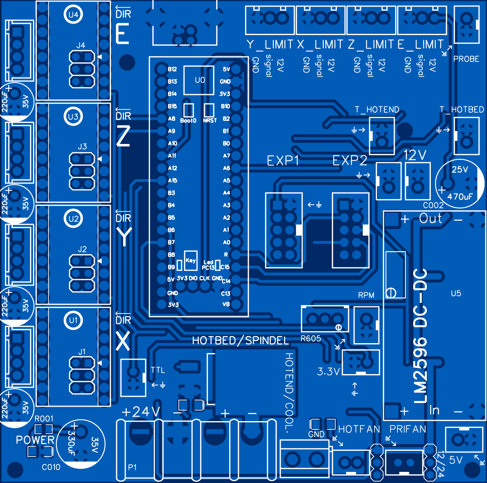
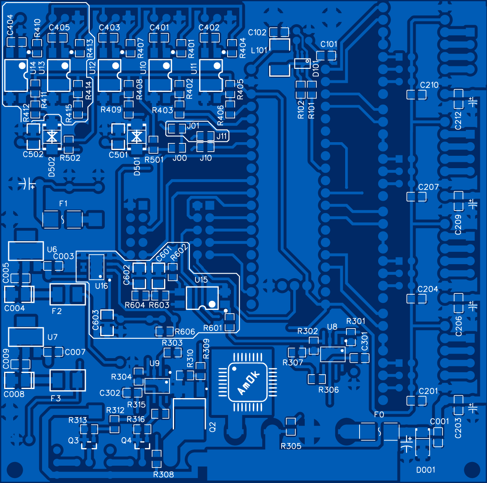
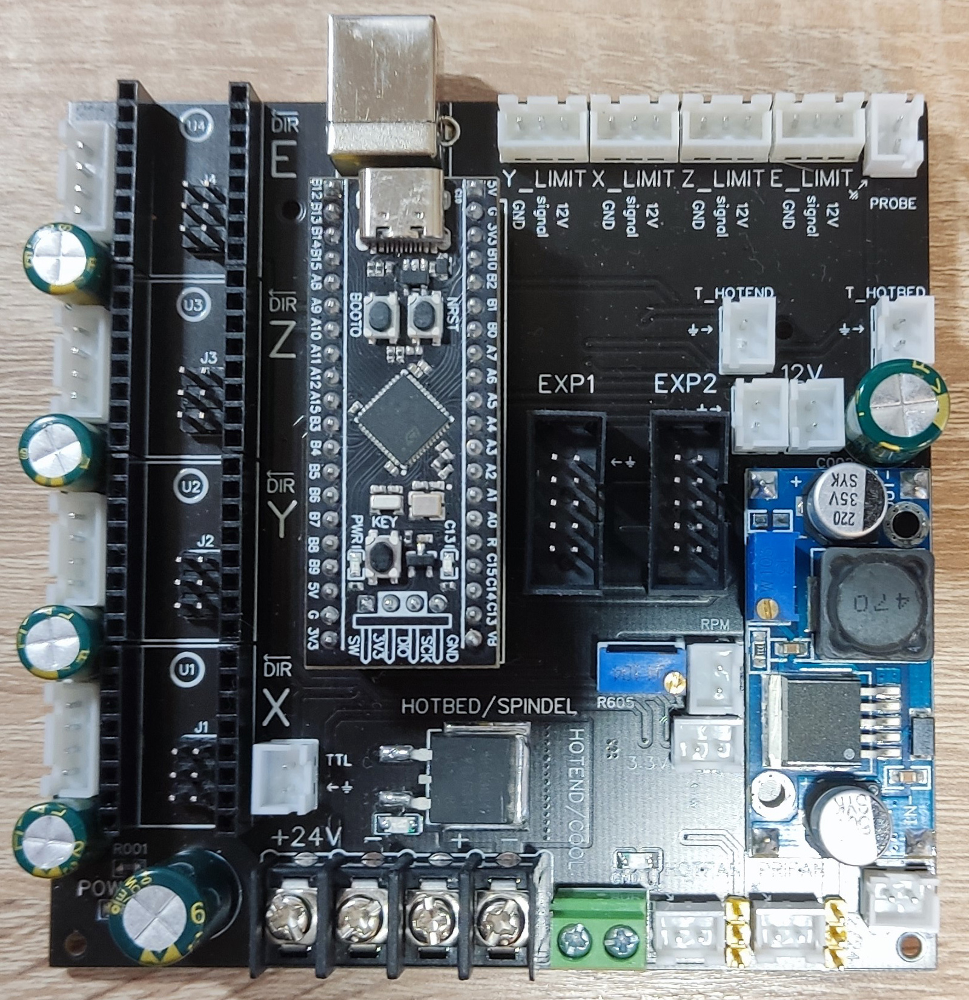
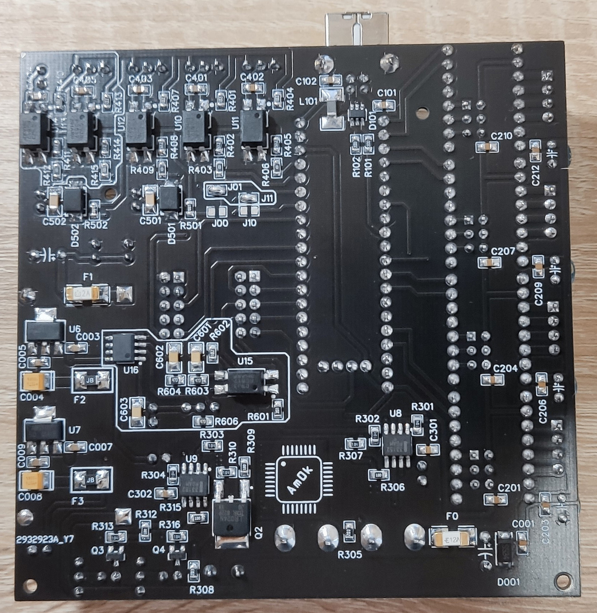
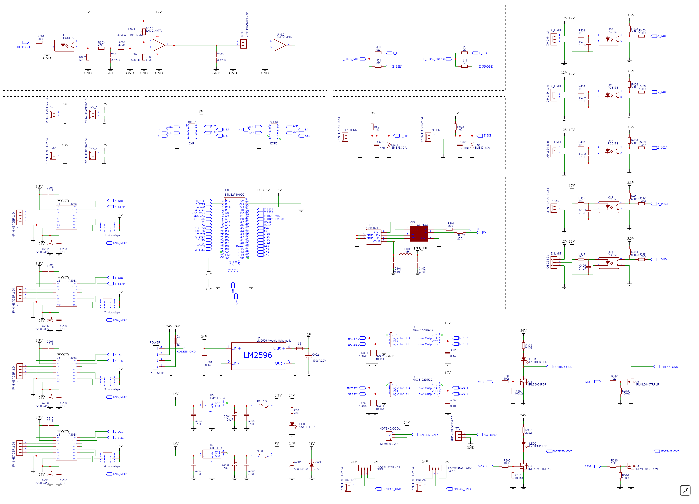

  
  
  
  
  

<h1 align="center">STM32F401CCU6 UNI CNC board</h1>

Проект открытой управляющей платы ЧПУ на основе МК STM32F401CCU6. Разработана для работы под управление прошивок Marlin и GRBL.

## Marlin 2.1.2.

Плата поддерживает и протестированна с прошивкой на базе Marlin 2.1.2.1. В репозитории вы можете найти как сами исходники модифицированной прошивки 
с уже добавленной поддержкой платы, так и инструкцию по модицикации оригинальных исходников <a href="https://github.com/MarlinFirmware/Marlin">Marlin</a>. 
Если когда нибудь плата получит хотя бы минимальное распространение, я приложу все усилия чтобы
она получила официальную поддержку и появилась в Marlin как самостоятельная плата.
Для компиляции использовался <a href="https://code.visualstudio.com">Visual Studio Code</a> с 
установленным PlatformIO, перед сборкой выбираем окружение `env:blackpill_f401cc_uni`.

## GRBL 1.1f.

Плата официально добавлена в прошивку <a href="https://github.com/grblHAL/STM32F4xx">GRBL HAL Driver</a>. 
В репозитории вы можете найти как сами исходники прошивки под самосборную 4-осевую кинематику (3 осевой фрезер + поворотная ось),
так и инструкцию по некоторой модицикации оригинальных исходников.
Для компиляции использовался <a href="https://code.visualstudio.com">Visual Studio Code</a> с 
установленным PlatformIO, перед сборкой выбираем окружение `env:blackpill_f401cc_uni`.

## Дополнительное ПО.

Так же вам могут быть полезны следующие программы для заливки прошивки по DFU:
 * <a href="https://www.st.com/en/development-tools/stsw-stm32080.html">DfuSe USB device firmware upgrade</a>
 * <a href="https://www.st.com/en/development-tools/stm32cubeprog.html">STM32 Cube Programmer</a>

## Внешний вид.

  
  

  
  

## Особенности.

Схему печатной платы, а так же гербер-файлы, необходимые для ее производства, вы найдете в репозитории.

Из особенностей следует отметить:
- Это минималистичная плата на основе современного и дешевого 32-битного МК STM32F401CCU6, для интеграции в нее подойдет
отладочная плата от WeAct, известная как BlackPill. Она дешевле и производительнее отладочных плат, основанных на
8-битном МК AtMega2560, рассчитаных на Ramps под управлением Marlin, и тем более намного производительнее плат на базе МК AtMega328
для работы с прошивкой GRBL.
- Питание платы осуществляется от блока питания 24 В, никаких дополнительных линий питания не требуется. 
- Питание нагревателя экструдера и нагревателя стола или небольшого коллекторного шпинделя осуществляется напряжением первичного питания. 
Вы можете подключить нагреваемый стол с потребляемым постоянным током до 15 А, заменив SMD предохранитель на плате.
По умолчанию установливается предохранитель на 12 А. В случае необходимости использовать внешнюю коммутацию 
(твердотельное реле нагревательного стола, мощный внешний драйвер шпинделя, TTL-драйвер лазера) на плате выведен
разъем TTL (3.3 В). Для управления бесколлекторными шпинделями, в драйвере которых предусмотрена аналоговая установка скорости вращения, на плате
установлен DAC с возможностью подстройки (R605) напряжения максимальных оборотов и соответствующий аналоговому уровню 0-10 В разъем RPM.
- Путем выбора установленных перемычек вы можете выбрать, подключать к МК цепочки измерения температуры для экструдера и стола (для Marlin - 
перемычки J00, J10), либо цепи опторазвязки концевика дополнительной 4 оси и Z-щупа (для GRBL - перемычки J01, J11). 
- Питание вентиляторов обдува нагревателя экструдера и обдува модели можно выбрать: 12 В или 24 В, установив джампер в соответствующее положение.
- Дополнительное питания 3.3 В, 5 В, 12В выведено с платы на соответствующие разъемы.
- Вы можете подключить лишь 4 драйвера шаговых двигателей, 3 для осей, 1 для экструдера в случае работы с прошивкой Marlin, 
4 для осей в случае работы с прошивкой GRBL.
- Обеспечена дополнительная защита МК: концевые выключатели установлены через опторазвязку, входы АЦП для термодатчиков экструдера и стола 
защищены от перенапряжения супрессорами, USB интерфейс защищен от электростатических разрядов. 
- Плата рассчитана на работу с концевыми выключателями, в которых общий (COM) сигнальный контакт нормально-замкнут на землю и при срабатывании 
коммутируется с +12В. При таком способе подключения выключатель "срабатывает" так же в случае его обрыва или отсоединения от платы. 
Также может быть использован индуктивный выключатель NPN с нормально замкнутым контактом LJ12A3-4-ZAX.
- Изменена входная цепочка измерения температуры. Подтягивающие резисторы установлены с сопротивлением 1kΩ, что обеспечивает большее количество 
отсчетов АЦП в диапазоне температур 80-300 C, а значит и большую точность поддержания заданной температуры.
К сожалению, это снижает количество отсчетов АЦП при температурах, близких к комнатным, однако, они не являются рабочими.

## BOM и производство.

Оригинальные печатные платы были произведены JLCPCB. Для самостоятельного изготовления или заказа вы можете воспользоваться
GERBER-файлами, приложенными в репозитории.

| Name                       |             Designator                                                | Quantity |
|:-------------------------- |:---------------------------------------------------------------------:| --------:|
|0805 SMD Resistor 10Ω	     |R306, R309, R312, R315	                                               |4|
|0805 SMD Resistor 20Ω	     |R101, R102	                                                           |2|
|0805 SMD Resistor 100Ω	     |R403, R406, R409, R412, R415	                                         |5|
|0805 SMD Resistor 1kΩ	     |R401, R404, R407, R410, R413, R501, R502, R602	                       |8|
|0805 SMD Resistor 5.1kΩ	   |R305, R308, R402, R405, R408	                                         |8|
|0805 SMD Resistor 20kΩ	     |R001, R305, R308	                                                     |3|
|0805 SMD Resistor 47kΩ	     |R603, R604, R606	                                                     |8|
|0805 SMD Resistor 100kΩ	   |R301, R302, R303, R304, R307, R310, R313, R316	                       |8|
|3296W-1-103 100kΩ	         |R605	                                                                 |1|
|0805 SMD Capacitor 0.1uF	   |C404, C405, C001, C003, C005, C007, C009, C101, C102, C201, C203,      |22|
|                            |C204, C206, C207, C209, C210, C212, C301, C302, C401, C402, C403       | |
|1206 SMD Capacitor  0.47uF	 |C501, C502, C601, C602, C603	                                         |5|
|Tantalum B case 68uF/10V	   |C004, C008	                                                           |2|
|Electrolytic cap. 220uF/35V |C202, C205 ,C208, C211	                                               |4|
|Electrolytic cap. 470uF/25V |C002	                                                                 |1|
|Electrolytic cap. 330uF/35V |C010	                                                                 |1|
|1206 SMD Inductor 1uH	     |L101	                                                                 |1|
|SS56	                       |D001	                                                                 |1|
|SMBJ3.3CA	                 |D501, D502	                                                           |2|
|1206 LED Red	               |LED1, LED2, LED0	                                                     |3|
|IRLML0040TRPbF	             |Q3, Q4	                                                               |2|
|IRLR024NTRLPBF	             |Q2	                                                                   |1|
|IRLS3034PBF	               |Q1	                                                                   |1|
|USBLC6-2SC6	               |D101	                                                                 |1|
|MC33152DR2G	               |U8, U9	                                                               |2|
|LM1117-3.3	                 |U6	                                                                   |1|
|LM1117-5	                   |U7	                                                                   |1|
|PC817S	                     |U10, U11, U12, U13, U14, U15	                                         |6|
|LM358M/TR	                 |U16	                                                                   |1|
|1808 fuse 12A	             |F0	                                                                   |1|
|1808 fuse 2A	               |F1	                                                                   |1|
|3216 resetable fuse 0.25A	 |F2, F3	                                                               |2|
|XH-2.54 2pin	               |3.3V, 5V, 12V_1, 12V_2, HOTFAN, PRIFAN, PROBE, RPM, TTL, T_HOTBED, T_HOTEND	|11|
|XH-2.54 3pin  	             |X_LIMIT, Y_LIMIT, Z_LIMIT, E_LIMIT	                                   |4|
|XH-2.54 4pin	               |E, X, Y, Z	                                                           |4|
|HRD-2x3-2.54-MALE	         |J1, J2 ,J3, J4	                                                       |4|
|HRD-1x3-2.54-MALE	         |POWERSWITCH1, POWERSWITCH2	                                           |2|
|KF301-5.0-2P	               |HOTEND	                                                               |1|
|KF7.62 4-PIN	               |P1	                                                                   |1|
|BH-10	                     |EXP1, EXP2	                                                           |2|
|USB-B	                     |USB1	                                                                 |1|
|HRD-1x8-2.54-FEMALE	       |U1, U2, U3, U4 connectors	                                             |8|
|STM32F401CC	               |U0	                                                                   |1|
|LM2596-Module-Schematic	   |U5	                                                                   |1|
|Stepper Motor Drivers	     |U1, U2, U3, U4	                                                       |4|

|                            |             Примечания:                                                          |
|:-------------------------- |:-------------------------------------------------------------------------------- |
|R501, R502	                 |Резисторы верхнего плеча в измерительных цепях температуры. Могут быть применены  |
|                            |стандартные 4.7 kΩ. Выбор 1 kΩ обусловлен повышением точности измерения           |
|                            |температуры в верхнем диапазоне температур экструдера, однако требует внесения    |
|                            |внесения правок в таблицы терморезисторов. Желательно использовать резисторы      |
|                            |с точностью 1%.                                                                   |      
|С501, С502	                 |Номиналы могут быть увеличены, если аналоговый вход будет «шуметь» и показания    |
|                            |температуры колебаться.                                                           |                   
|EXP1, EXP2	                 |Устанавливать следует исходя из того, как стоит ключ на ответных разъемах дисплея.|
|J00, J10	                   |Перемычки устанавливаются при работе с прошивкой Marlin, подключают цепи измерения|
|                            |температуры рабочего стола и хотэнда к МК.                                        |
|J01, J11	                   |Перемычки устанавливаются при работе с прошивкой GRBL, подключают цепи концевика  |
|                            |дополнительной оси и Z-щупа к МК.                                                 |

|                            | Цепи, которые могут быть исключены:                                              |
|:-------------------------- |:-------------------------------------------------------------------------------- |
|T_HOTEND, R501, С501, D501	 |Измерение температуры хотэнда.                                                    |
|T_HOTBED, R502, С502, D502	 |Измерение температуры рабочего стола.                                             |
|PROBE, R410, R411, R412,    |Z-щуп.                                                                            |
|C404, U14	                 |                                                                                  |
|E_LIMIT, R413, R414, R415,  |Концевой выключатель дополнительной оси.                                          |
|C405, U15                   |                                                                                  |
|RPM, R601, R602, R603, R604,|ЦАП формиравания сигнала 0-10В для управления скоростью бесколлекторных           |
|R605, R606, C601, C602,     |шпинделей.                                                                        |
|C603, U16                   |	                                                                                |
|R305, R306, R307, Q1, LED1	 |Силовой мосфет управления нагревом стола / скоростью вращения шпинделя.           |

## Обратная связь.

Буду рад любой обратной связи относительно этого проекта, а так же отвечу на вопросы.
Почтовый адрес `b1gb0ss@mail.ru`.
Так же буду крайне благодарен в случае помощи с качественным переводом информации, размещенной в данном репозитории.

## Лицензия.

Принципиальная схема, BOM-лист, аннотации к нему и файлы для производства находятся под действием [CERN Open Hardware Licence Version 2 - Strongly Reciprocal](/LICENSE.txt). Исходный код примеров прошивок публикуется под лицензиями, которым подчиняется оригинальный исходный код. Ответственность за использование любых материалов этого репозитория целиком и полностью лежит на вас. Я верю в открытую разработку силами энтузиастов, и прошу вас так же делиться своими наработками. Если же вы собираетесь использовать эти наработки в закрытом виде или защищенном патентом виде, прошу вас выбрать другие источники.